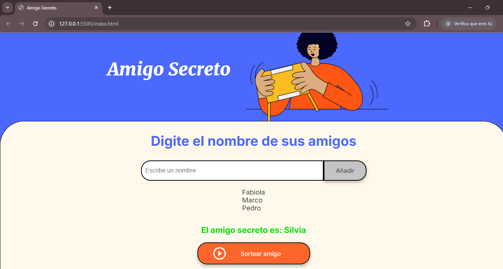

<h1>Proyecto: Sorteo de Amigo Secreto</h1>

Este proyecto es una aplicación web simple para organizar un sorteo de amigo secreto. Los usuarios pueden agregar amigos a una lista y realizar un sorteo aleatorio para determinar quién será el amigo secreto de cada persona.

<h2>Funcionalidades</h2>
<ul>
<ol><strong>Agregar Amigos:</strong> Los usuarios pueden agregar nombres a una lista de amigos.</ol>
<ol><strong>Mostrar Lista de Amigos:</strong> La aplicación muestra una lista actualizada con todos los amigos agregados.</ol>
<ol><strong>Sorteo Aleatorio:</strong> La aplicación selecciona aleatoriamente un nombre de la lista de amigos como "amigo secreto".</ol>
<ol><strong>Validación de Entradas:</strong> La aplicación verifica que el nombre ingresado no esté vacío antes de agregarlo a la lista.</ol>
</ul>
<h2>Instrucciones de Uso</h2>
<ul>
<ol>Ingresa un nombre en el campo de texto.</ol>
<ol>Haz clic en el botón Agregar Amigo para añadirlo a la lista de amigos.</ol>
<ol>Para realizar el sorteo, haz clic en el botón Sortear Amigo. La aplicación seleccionará aleatoriamente un nombre de la lista como el "amigo secreto".</ol>
<ol>La lista se actualizará después de cada sorteo.</ol>
</ul>
<h2>Tecnologías Utilizadas</h2>
<ul>
<ol>HTML: Para la estructura de la página.</ol>
<ol>CSS: Para el estilo y diseño de la interfaz.</ol>
<ol>JavaScript: Para la funcionalidad y lógica del sorteo y la lista dinámica.</ol>
</ul>
 <h2>Captura de Pantalla</h2>
    
A continuación se muestra una captura de pantalla de la interfaz de la aplicación:

    
    
Cada vez que algún nombre salga sorteado sera eliminado de la lista.

